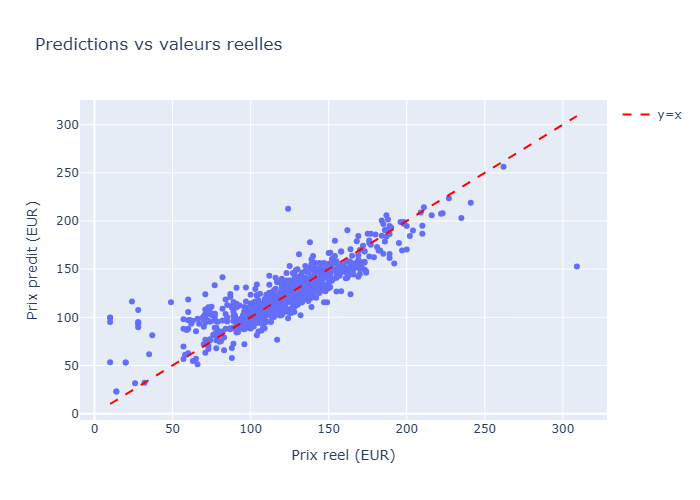

# 🚗 GetAround - Analyse des retards & Pricing API


---

## 📋 Contexte du Projet

GetAround est une plateforme de location de voitures entre particuliers. Les retards au checkout generent des frictions pour les conducteurs suivants (attente, voire annulation).

**Problematique** : definir un **seuil minimum entre deux locations** consecutives pour reduire les conflits, tout en minimisant l'impact sur le chiffre d'affaires.

**Deux volets :**
1. **Analyse des retards** : EDA sur 21 310 locations pour quantifier le probleme et simuler des seuils
2. **Pricing ML** : modele de prediction du prix journalier, deploye via API FastAPI

---

## 🎯 Resultats

### Analyse des retards

| Indicateur | Valeur |
|---|---|
| Locations totales | 21 310 |
| Locations en retard | 57.5% |
| Cas problematiques (retard > buffer) | 218 / 1 841 consecutives (11.8%) |
| Annulations liees aux retards | 37 (17% des cas problematiques) |

**Recommandation : seuil de 120 min, scope Connect uniquement**
- Resout **84%** des cas problematiques pour Connect
- Ne bloque que **36%** des locations consecutives Connect
- Les voitures Connect (20% du parc) sont plus sensibles car le checkin est sans contact


### Pricing ML

| Modele | R2 | MAE | RMSE |
|---|---|---|---|
| Linear Regression | 0.6937 | 12.12 EUR | 17.96 EUR |
| **Gradient Boosting** | **0.7504** | **10.29 EUR** | **16.22 EUR** |

Top 3 features : puissance moteur (46%), kilometrage (27%), GPS (5%)




---

## 🏗️ Pipeline Technique

### Analyse des retards
1. **Chargement** des donnees Excel (21 310 locations, 7 colonnes)
2. **EDA** : distributions, retards par type de checkin, analyse des valeurs manquantes
3. **Jointure** des locations consecutives pour identifier les cas problematiques
4. **Simulation** de seuils (0-720 min) croises avec le scope (all / connect)
5. **Dashboard Streamlit** interactif avec slider de seuil et graphiques Plotly

### Pricing ML
1. **Preprocessing** via `ColumnTransformer` : `StandardScaler` (numeriques), `OneHotEncoder` (categoriques), passthrough (booleens)
2. **Modelisation** : Linear Regression (baseline) puis Gradient Boosting (200 estimators, depth 5)
3. **Validation** : train/test split 80/20 + cross-validation 5 folds
4. **Tracking MLflow** : log des parametres, metriques et modeles pour chaque run
5. **Export** : pipeline sklearn complete en `.joblib`, servie via FastAPI
6. **Deploiement** : Docker + HuggingFace Spaces

### Choix techniques
- **Gradient Boosting** plutot que Random Forest : meilleures performances sur ce dataset (R2 +0.05) et meilleur controle du bias-variance via le learning rate
- **Pipeline sklearn** : encapsule preprocessing + modele pour eviter tout data leakage entre train et test
- **`drop='first'`** sur OneHotEncoder : evite la multicolinearite dans la regression lineaire
- **MLflow** : tracking des experiences pour comparer les modeles objectivement
- **Plotly** (impose par le cursus) : graphiques interactifs dans le notebook et le dashboard

---

## 🚀 Installation et Execution

### Prerequis
- Python 3.10+
- Docker (optionnel, pour le deploiement local)

### En local

```bash
git clone https://github.com/athanormark/GETAROUND-BLOC-5_JEDHA_FORMATION.git
cd GETAROUND-BLOC-5_JEDHA_FORMATION

pip install -r requirements.txt
```

Les datasets sont a telecharger manuellement :
- [Delay Analysis](https://full-stack-assets.s3.eu-west-3.amazonaws.com/Deployment/get_around_delay_analysis.xlsx) → `data/`
- [Pricing](https://full-stack-assets.s3.eu-west-3.amazonaws.com/Deployment/get_around_pricing_project.csv) → `data/`

```bash
# Notebook
jupyter notebook getaround_analysis.ipynb

# Dashboard
cd dashboard && streamlit run app.py

# API
cd api && uvicorn app:app --reload
```

### Avec Docker

```bash
# API
cd api && docker build -t getaround-api . && docker run -p 7860:7860 getaround-api

# Dashboard
cd dashboard && docker build -t getaround-dashboard . && docker run -p 7860:7860 getaround-dashboard
```

### Tester l'API

```bash
# En local
curl -X POST "http://localhost:7860/predict" \
  -H "Content-Type: application/json" \
  -d '{"input": [["Renault", 140000, 135, "diesel", "black", "sedan", true, true, false, false, true, true, true]]}'

# En production
curl -X POST "https://athanormark-getaround-pricing-api.hf.space/predict" \
  -H "Content-Type: application/json" \
  -d '{"input": [["Renault", 140000, 135, "diesel", "black", "sedan", true, true, false, false, true, true, true]]}'
```

Reponse : `{"prediction": [139.12]}`

---

## 📂 Structure du Projet

```
├── getaround_analysis.ipynb    # Notebook principal (EDA + ML)
├── dashboard/
│   ├── app.py                  # Dashboard Streamlit
│   ├── Dockerfile
│   ├── requirements.txt
│   └── data/                   # Donnees pour le dashboard
├── api/
│   ├── app.py                  # API FastAPI (/predict + /docs)
│   ├── model.joblib            # Modele entraine (Gradient Boosting)
│   ├── Dockerfile
│   └── requirements.txt
├── assets/images/              # Graphiques exportes
├── data/                       # Datasets (non versiones)
├── requirements.txt            # Dependances globales
└── .gitignore
```

---

## 🔗 Liens de production

| Service | URL |
|---|---|
| **API Pricing** | https://athanormark-getaround-pricing-api.hf.space |
| **Documentation API** | https://athanormark-getaround-pricing-api.hf.space/docs |
| **Swagger interactif** | https://athanormark-getaround-pricing-api.hf.space/swagger |

---

## 👤 Auteur

**Athanor SAVOUILLAN**
