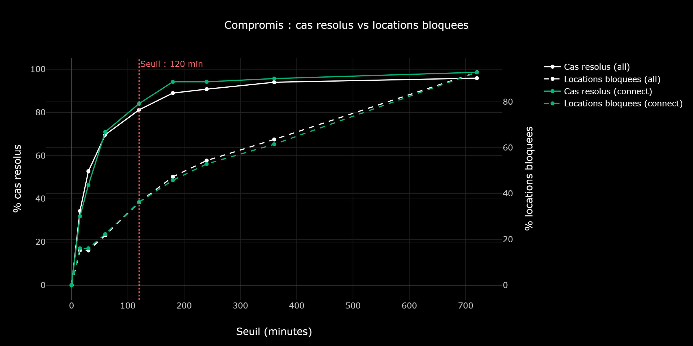
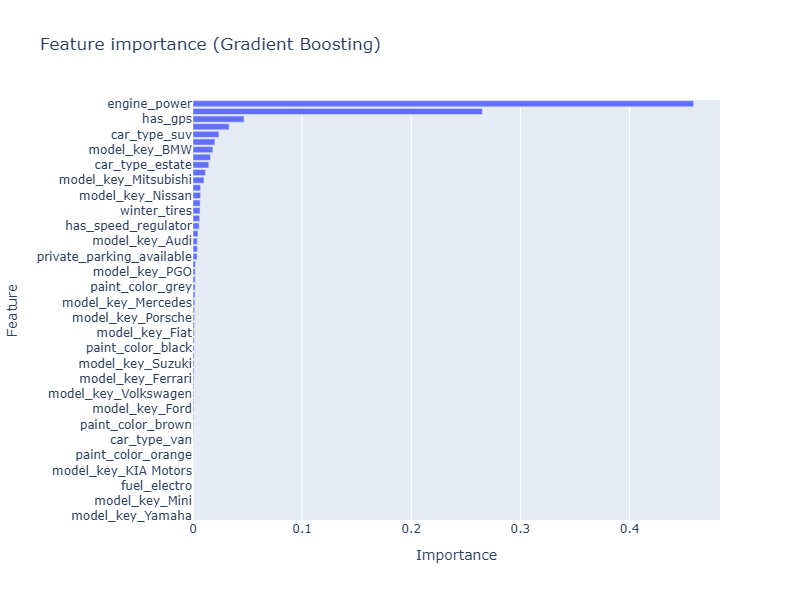

# GetAround - Analyse des retards & Pricing API

[](#)
[](#)
[](#)
[](#)
[](#)
[](#)
[](#)

---

## About

Projet du **Bloc 5 - Jedha Bootcamp** : industrialisation d'un algorithme d'apprentissage automatique et automatisation des processus de decision.

GetAround est une plateforme de location de voitures entre particuliers. Les retards au checkout generent des frictions pour les conducteurs suivants (attente, voire annulation). L'objectif est double :

1. Definir un **seuil minimum entre deux locations** consecutives pour reduire les conflits, tout en minimisant l'impact sur le chiffre d'affaires.
2. Construire un **modele de pricing** capable de predire le prix journalier optimal d'un vehicule.

| Livrable | Description | Lien |
|---|---|---|
| Dashboard Streamlit | Analyse interactive des retards et simulation de seuils | [Acceder au dashboard](https://athanormark-getaround-dashboard.hf.space) |
| API Pricing (FastAPI) | Endpoint `/predict` pour la prediction du prix journalier | [Acceder a l'API](https://athanormark-getaround-pricing-api.hf.space) |
| Documentation API | Page `/docs` avec description des endpoints | [Voir la documentation](https://athanormark-getaround-pricing-api.hf.space/docs) |
| Swagger interactif | Interface de test `/swagger` (OpenAPI) | [Tester l'API](https://athanormark-getaround-pricing-api.hf.space/swagger) |

---

## Dataset

### Analyse des retards

- **Source** : [get_around_delay_analysis.xlsx](https://full-stack-assets.s3.eu-west-3.amazonaws.com/Deployment/get_around_delay_analysis.xlsx)
- **Volume** : 21 310 locations, 7 colonnes
- **Types de checkin** : Mobile (80%) et Connect (20%)

### Pricing ML

- **Source** : [get_around_pricing_project.csv](https://full-stack-assets.s3.eu-west-3.amazonaws.com/Deployment/get_around_pricing_project.csv)
- **Volume** : 4 843 vehicules, 13 features, aucune valeur manquante
- **Target** : `rental_price_per_day` (prix journalier en EUR)

---

## Installation

### Prerequis

- Python 3.10+
- Docker (optionnel)

### Setup

```bash
git clone https://github.com/athanormark/GETAROUND-BLOC-5_JEDHA_FORMATION.git
cd GETAROUND-BLOC-5_JEDHA_FORMATION
pip install -r requirements.txt
```

Telecharger les datasets dans `data/` :
- [Delay Analysis (.xlsx)](https://full-stack-assets.s3.eu-west-3.amazonaws.com/Deployment/get_around_delay_analysis.xlsx)
- [Pricing (.csv)](https://full-stack-assets.s3.eu-west-3.amazonaws.com/Deployment/get_around_pricing_project.csv)

```bash
# Notebook
jupyter notebook getaround_analysis.ipynb

# Dashboard
cd dashboard && streamlit run app.py

# API
cd api && uvicorn app:app --reload
```

---

## Pipeline

### Partie 1 - Analyse des retards

| Indicateur | Valeur |
|---|---|
| Locations terminees | 18 045 (84.7%) |
| Locations annulees | 3 265 (15.3%) |
| En retard au checkout | 57.5% des locations avec donnees de checkout |
| Retard moyen (quand retard) | 202 min (3h22) |
| Retard median (quand retard) | 53 min |
| Locations consecutives | 1 841 (8.6%) |
| Cas problematiques (retard > buffer) | 218 (11.8% des consecutives) |
| Annulations liees aux retards | 37 (17% des cas problematiques) |

Les locations **Connect** sont en moyenne rendues en avance (median -9 min), tandis que les locations **Mobile** sont en moyenne rendues en retard (median +14 min).

### Partie 2 - Pricing ML

1. **Preprocessing** (`ColumnTransformer`) : `StandardScaler` (numeriques), `OneHotEncoder` avec `handle_unknown='ignore'` (categoriques), passthrough (booleens)
2. **Modeles** : Linear Regression (baseline) et Gradient Boosting (200 estimators, depth 5, lr 0.1)
3. **Validation** : train/test split 80/20 + cross-validation 5 folds
4. **Tracking** : MLflow (parametres, metriques, artefacts)

---

## Resultats

### Analyse des retards - Simulation des seuils



**Recommandation : seuil de 120 minutes, scope Connect uniquement**

- Resout **84%** des cas problematiques pour les voitures Connect
- Ne bloque que **36%** des locations consecutives Connect
- Impact revenus limite : les voitures Connect representent 20% du parc
- Le checkin sans contact des voitures Connect les rend plus sensibles aux retards

### Pricing ML - Comparaison des modeles

| Modele | R2 | MAE | RMSE |
|---|---|---|---|
| Linear Regression | 0.6937 | 12.12 EUR | 17.96 EUR |
| **Gradient Boosting** | **0.7504** | **10.29 EUR** | **16.22 EUR** |

Cross-validation Gradient Boosting : R2 = 0.693 (+/- 0.070).

### Feature importance



Features les plus correlees au prix : puissance moteur (+0.63), kilometrage (-0.45), automatique (+0.42), Connect (+0.32), GPS (+0.31).

---

## Docker

```bash
# API
cd api && docker build -t getaround-api . && docker run -p 7860:7860 getaround-api

# Dashboard
cd dashboard && docker build -t getaround-dashboard . && docker run -p 7860:7860 getaround-dashboard
```

---

## Conclusion

Le projet repond aux deux problematiques GetAround :

**1. Seuil entre locations** : un seuil de **120 minutes**, applique uniquement aux voitures **Connect**, resout **84% des cas problematiques** tout en ne bloquant que 36% des locations consecutives Connect. L'impact sur le chiffre d'affaires est limite car les voitures Connect representent 20% du parc. Les voitures Mobile, dont le checkout est deja supervise en personne, n'ont pas besoin de ce seuil.

**2. Pricing ML** : le **Gradient Boosting** (R2=0.75, MAE=10.29 EUR) predit le prix journalier optimal d'un vehicule. La puissance moteur (+0.63), le kilometrage (-0.45) et la transmission automatique (+0.42) sont les variables les plus influentes. Le modele est deploye via une API FastAPI accessible en ligne.

**Livrables deployes** : dashboard Streamlit (simulation interactive des seuils), API FastAPI (endpoint /predict), tracking MLflow. Tout est containerise avec Docker et heberge sur HuggingFace Spaces.

---

## Structure du projet

```
GETAROUND-BLOC-5_JEDHA_FORMATION/
├── getaround_analysis.ipynb       # Notebook principal (EDA + ML + MLflow)
├── dashboard/
│   ├── app.py                     # Dashboard Streamlit
│   ├── Dockerfile
│   └── requirements.txt
├── api/
│   ├── app.py                     # API FastAPI (/predict, /docs, /swagger)
│   ├── model.joblib               # Pipeline sklearn (Gradient Boosting)
│   ├── Dockerfile
│   └── requirements.txt
├── assets/images/                 # Graphiques exportes (PNG)
├── data/                          # Datasets (non versionnes)
├── requirements.txt               # Dependances globales
└── README.md
```

Les services sont heberges sur **HuggingFace Spaces** (tier gratuit). Les Spaces peuvent se mettre en veille apres une periode d'inactivite : le premier chargement prend quelques secondes.

---

## Auteur

Athanor SAVOUILLAN · [GitHub](https://github.com/athanormark)
